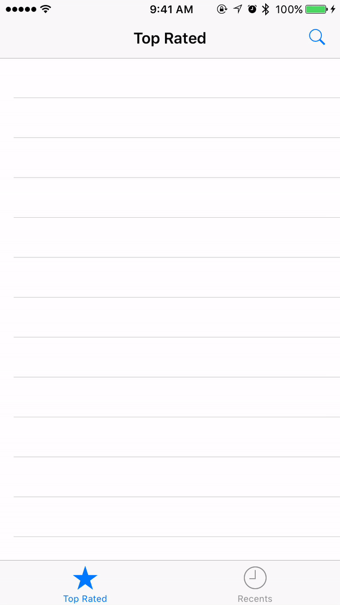
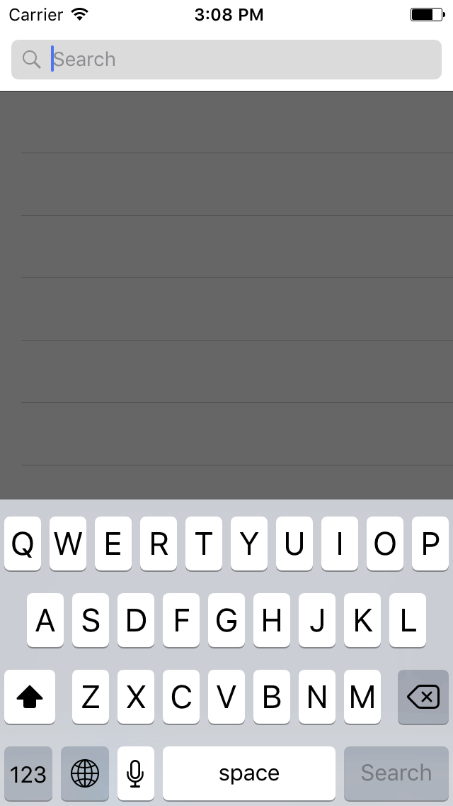
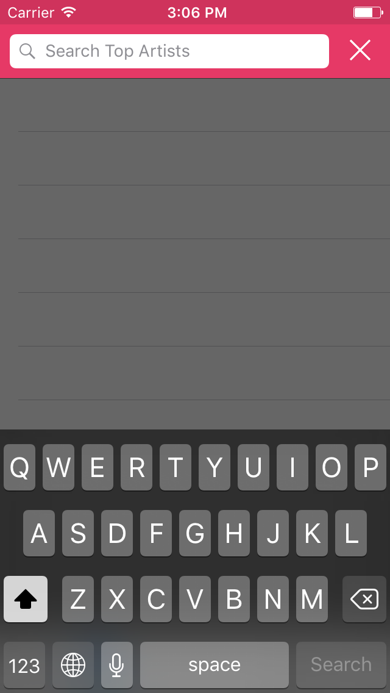

# AZSearchView
A search controller with auto-complete suggestions written in Swift 3.

 

##Usage

Create a property of type ```AZSearchViewController``` and a String array to hold the data.
```swift
    var searchController: AZSearchViewController!
    var resultArray:[String] = []
```

Implement the delegate and data source protocols:
```swift
extension ViewController: AZSearchViewDelegate{
    
    func searchView(_ searchView: AZSearchViewController, didSearchForText text: String) {
        searchView.dismiss(animated: false, completion: nil)
    }
    
    func searchView(_ searchView: AZSearchViewController, didTextChangeTo text: String, textLength: Int) {
        self.resultArray.removeAll()
        if textLength > 3 {
            for i in 0..<arc4random_uniform(10)+1 {self.resultArray.append("\(text) \(i+1)")}
        }

        searchView.reloadData()
    }
    
    func searchView(_ searchView: AZSearchViewController, didSelectResultAt index: Int, text: String) {
        self.searchController.dismiss(animated: true, completion: {
            self.pushWithTitle(text: text)
        })
    }
}

extension ViewController: AZSearchViewDataSource{
    
    func results() -> [String] {
        return self.resultArray
    }
}
```

Now initialize the controller object:
```swift
    override func viewDidLoad() {
        super.viewDidLoad()
        
        self.searchController = AZSearchViewController()
        self.searchController.delegate = self
        self.searchController.dataSource = self
    }
```

And finally present when needed:

```swift
self.present(searchController, animated: true, completion: nil)
```

##Customizations

Default Vs. Customized




```swift
    self.searchController.searchBarPlaceHolder = "Search Top Artists"
    self.searchController.navigationBar.barTintColor = #colorLiteral(red: 0.9019607843, green: 0.2235294118, blue: 0.4, alpha: 1)
    self.searchController.statusBarUnderlayOpacity = 0.10
    self.searchController.navigationBar.tintColor = UIColor.lightGray
    self.searchController.searchBarBackgroundColor = .white
    self.searchController.statusBarStyle = .lightContent
    self.searchController.keyboardAppearnce = .dark
    let item = UIBarButtonItem(barButtonSystemItem: .stop, target: self, action: #selector(ViewController.close(sender:)))
    item.tintColor = .white
    self.searchController.navigationItem.rightBarButtonItem = item
```

You can also configure with the following constants:

```swift
struct AZSearchViewPref{
    
    //The background color of the controller, default is black with 60% opacity
    static let backgroundColor: UIColor = UIColor(colorLiteralRed: 0.0, green: 0.0, blue: 0.0, alpha: 0.6)
   
    //The search bar background color, default is a light grey color
    static let searchBarColor: UIColor = UIColor(colorLiteralRed: 0.86, green: 0.86, blue: 0.86, alpha: 1)
    
    /*I recommended not to modify any of these values*/
    
    static let searchBarPortraitHeight:CGFloat = 64
    
    static let searchBarLandscapeHeight:CGFloat = 32
    
    static let searchBarPortraitOffset:CGFloat = 10
    
    static let searchBarLandscapeOffset:CGFloat = 0
    
    //The animation duration after rotating from portrait to landscape.
    static let animationDuration = 0.3

}

```

